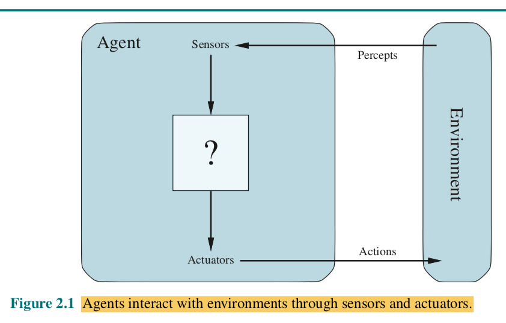
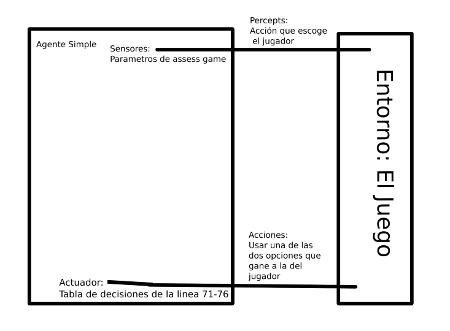

Práctica Axentes Intelixentes
=============================

   * [O problema](#o-problema)
   * [Contorno de tarefas](#tcontorno-de-tarefas)
   * [Estrutura do axente](#estrutura-do-axente)
   * [Implementación](#implementación)
   * [Extensión](#extensión)
   * [Entrega](#entrega)
   * [Bibliografía](#bibliografía)

Proponse programar un axente intelixente solución ao entorno de tarefas do xogo pedra, papel, tesoiras, seguindo as directrices de modelado propostas no capítulo 2 _Intelligent Agents_ do libro _IA: A modern approach, Russell & Norvig_.

Para iso é necesario:

1. Especificar as características do contorno de tarefas.
2. Identificar o tipo de axente para determinar a estrutura do axente.
3. Implementar en Python os compoñentes da estrutura do axente para construir a función axente ou función mapa.

## O problema

Estudia a [solución básica](doc/codigo_RPS_explicado.md) ao xogo pedra, papel, tesoiras (desde agora RPS, siglas en inglés correspondentes a _Rock, Paper, Scissors_).

Intenta comprender os constructos Python que se empregan.

## Contorno de tarefas

Especifica as características do contorno de tarefas do RPS e xustifica a túa resposta, segundo o epígrafe _"2.3.2 Properties of task environments"_ do capítulo 2 _Intelligent Agents_ do libro _IA: A modern approach, Russell & Norvig_.

Resume as características do contorno nunha táboa co formato:

Contorno de tarefas |  Observable  | Axentes | Determinista | Episódico | Estático | Discreto |  Coñecido  
:---: |:------------:|:-------:|:------------:|:---------:|:--------:|:--------:|:----------:|
 RPS | Parcialmente |  Multi  | Determinista | Episódico | Estático | Discreto |   Conocido |
 RPSLS | Parcialmente |  Multi  | Determinista | Episódico | Estático | Discreto |   Conocido |

No libro atoparás unha táboa semellante:

Exemplos contornas de tarefas.

## Estrutura do axente

O noso propósito é deseñar o **programa axente** que implementa a **función axente** ou a **función que mapea** as percepcións a accións. 

A partires do modelo xeral de axente intelixente da figura:

**debuxa un modelo adecuado** ao contorno de tarefas e a un dos catro **tipos de programas axente**:

- Axentes reactivos simples
- Axentes reactivos baseados en modelos.
- Axentes baseados en obxectivos.
- Axentes baseados en utilidade.

Cada clase de axente combina compoñentes particulares dun modo particular para xerar as accións. 

## Implementación - Simulando IA

Implementa en Python os compoñentes da estrutura do axente para construir a función axente ou función mapa.

Lee o código contigo en [src](src/) e os [comentarios ao código](doc/codigo_RPS_explicado.md).

Modifica a función `get_computer_action()` coa estratexia que consideres máis proveitosa para maximizar o **rendemento** do axente. Recorda que a medida do rendemento vese afectada por diversas consideracións.

Engade os compoñentes software que precises para implementar os compoñentes do tipo de programa axente que deseñaches no epígrafe anterior que, de xeito xeral, se incluen na figura seguinte:

Consegue que o código satisfaga os principios **SOLID**, en particular, **SRP** e **OCP** para extender a súa lóxica a diferentes versións do xogo.

## Extensión

Unha vez programado o axente para a versión clásica do RPS, extende o súa lóxica para xogar á versión  [pedra, papel, tesoiras, lagarto, Spock](http://www.samkass.com/theories/RPSSL.html)

## Entrega

Nun proxecto no teu github /gitlab co teu código e a documentación, esta última recollida no `README` do proxecto e escrita en formato Markdown.

## Bibliografía

Lutz, Mark. _Learning Python_. Sebastopol, Ca, O’reilly, 2018.

Martin, Robert C. _Clean Code a Handbook of Agile Software Craftmanship_. Upper Saddle River [Etc.] Prentice Hall, 2010.

Martin, Robert C. _Clean Architecture: A Craftsman’s Guide to Software Structure and Design_. Prentice Hall, 2018.

S. McConnel. _Code Complete: A Practical Handbook of Software Construction_, 2dn Edition. Microsoft Press, 2004.

Russell, Peter. _ARTIFICIAL INTELLIGENCE : A Modern Approach_, Global Edition. S.L., Pearson Education Limited, 2021.

## Estructura do proxecto / rubrica

A documentación presentada no `README.md` debe **seguir esta orde e título de epígrafes:**

1.**Especificación do contorna de tarefas**

Especifica todas as características da contorna de tarefas do RPS, justificando cada unha con precisión segundo a sección _"2.3.2 Properties of task environments"_ do libro _"IA: A Modern Approach"_ de Russell & Norvig.

2.**Identificación do tipo de axente e estrutura**

Selecciona un tipo de axente adecuado para o RPS e debuxa un modelo preciso da estrutura do axente, incluíndo os compoñentes específicos do tipo elixido, baseándoche nos conceptos do capítulo 2 _"Intelligent Agents"_.

É moi importante que ademáis da figura escribas un texto enumerando e xustificando a presenza dous comppñentes recollidos na figura anterior. Sen explicacións a figura non se avalía.

3.**Implementación en Python**

Implementa en Python todos os compoñentes da estrutura do axente de forma correcta e eficiente, creando unha función axente que xoga ao RPS seguindo a lóxica do tipo de axente seleccionado. O código cumpre cos principios SOLID, especialmente SRP e OCP, permitindo estender a lóxica a outras versións do xogo. **A estratexia implementada en `get_computer_action()` é creativa e busca maximizar o rendemento do axente**.

O teu código pode e debe ser modular seguindo o principio SRP, pero **a execución da lóxica ten que invocarse dende a función `get_computer_action()`.

A rúbrica da implementación Python [na segunda folla "RPS" deste libro de cálculo.](https://docs.google.com/spreadsheets/d/1r93uZnPmioY0U1D7EDtV1uveKYIOlenkz8uuqks4KXM/) Loguéate antes na túa conta de gmail con acceso ao noso Drive.

4.**Extensión ao RPS + Lizzard Spock**

- Estende a lóxica do axente para xogar á versión "pedra, papel, tesoiras, lagarto, Spock" correctamente, mantendo a calidade do código e a coherencia co tipo de axente seleccionado. 

- A documentación no README do proxecto en GitHub/GitLab deber estar completa seguindo a orde especificada nesta rúbrica, explicando o problema, a contorna de tarefas, a estrutura do axente, a implementación e a extensión, cun formato Markdown axeitado.

